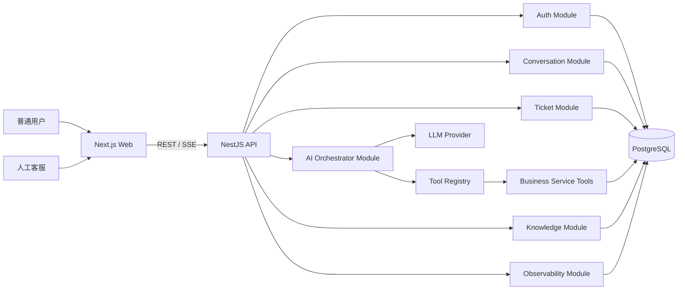
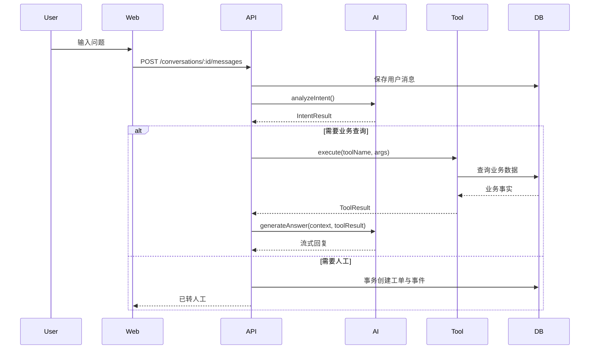
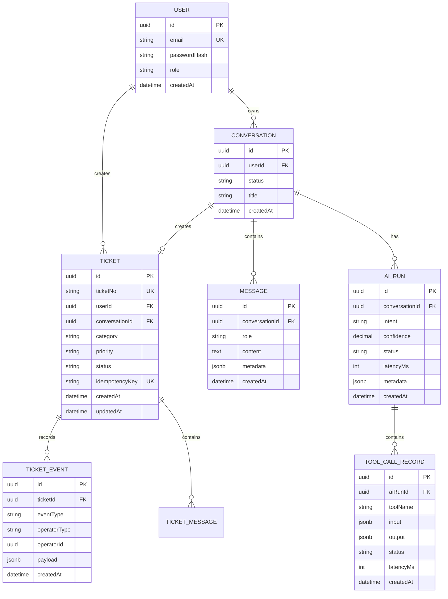
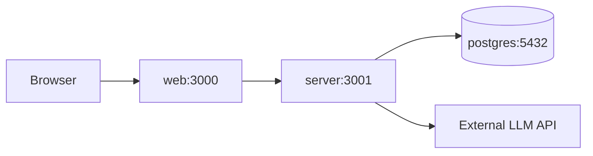

# FinServe AI 架构技术设计文档

> 项目名称：FinServe AI——消费金融智能客服与工单协同平台  
> 文档版本：V1.0  
> 架构目标：一周内实现可运行、可部署、可讲解的 AI 全栈 MVP  
> 核心技术栈：Next.js + NestJS + PostgreSQL + Prisma + Docker Compose

---

## 1. 技术目标

本项目需要同时证明以下能力：

1. 能独立完成前后端业务闭环；
2. 能设计关系型数据库与状态流转；
3. 能实现鉴权、事务、幂等、审计和异常处理；
4. 能接入大模型结构化输出与 Tool Calling；
5. 能在模型不可靠时通过工具和人工兜底；
6. 能使用 Docker Compose 完成本地部署。

项目不追求复杂微服务架构，首版采用模块化单体，优先保证完整性和可解释性。

---

## 2. 技术选型

| 层级 | 技术 | 选择理由 |
|---|---|---|
| Web 前端 | Next.js + React + TypeScript | 复用现有 React/TS 能力，支持 SSR 与全栈路由 |
| UI | Ant Design 或 Tailwind CSS | 快速搭建用户端与管理后台 |
| 后端 | NestJS + TypeScript | 模块化、依赖注入、DTO、Swagger，便于展示服务端工程能力 |
| ORM | Prisma | 类型安全、迁移清晰、开发效率高 |
| 数据库 | PostgreSQL | 事务、索引、JSONB、全文检索和后续 pgvector 扩展能力 |
| 鉴权 | JWT + bcrypt | MVP 成本低，便于角色控制 |
| AI 接口 | OpenAI 兼容 SDK | 支持结构化输出、Tool Calling 和流式响应 |
| API 文档 | Swagger / OpenAPI | 体现接口契约与调试能力 |
| 部署 | Docker Compose | 一键启动 Web、Server、PostgreSQL |
| 日志 | Pino 或 NestJS Logger | 结构化日志与 Request ID |

---

## 3. 总体架构



---

## 4. 架构风格

### 4.1 模块化单体

首版不拆微服务，NestJS 内部按照业务边界拆分模块：

```text
src/
├── auth/
├── users/
├── conversations/
├── messages/
├── tickets/
├── knowledge/
├── ai/
├── tools/
├── audit/
├── common/
└── prisma/
```

优点：

- 一周内可完成；
- 本地调试简单；
- 数据事务边界清晰；
- 后续可以按模块拆分服务；
- 面试时容易解释演进过程。

### 4.2 分层设计

```text
Controller
    ↓
Application Service
    ↓
Domain / Business Logic
    ↓
Prisma Repository
    ↓
PostgreSQL
```

AI 模块不允许直接访问数据库，必须通过工具层调用业务服务。

---

## 5. 推荐仓库结构

```text
finserve-ai/
├── apps/
│   ├── web/                    # Next.js
│   │   ├── app/
│   │   ├── components/
│   │   ├── features/
│   │   ├── lib/
│   │   └── services/
│   └── server/                 # NestJS
│       ├── src/
│       ├── prisma/
│       └── test/
├── packages/
│   ├── shared-types/
│   ├── eslint-config/
│   └── tsconfig/
├── docker-compose.yml
├── pnpm-workspace.yaml
└── README.md
```

推荐使用 pnpm workspace 管理 Monorepo。

---

## 6. 核心模块设计

## 6.1 Auth Module

职责：

- 用户登录；
- 密码校验；
- 生成 JWT；
- 解析用户身份；
- 角色权限校验。

角色：

```ts
type Role = 'USER' | 'AGENT' | 'ADMIN'
```

关键设计：

- 密码使用 bcrypt；
- Access Token 设置合理过期时间；
- Guard 负责鉴权；
- Decorator 获取当前用户；
- 用户只能访问自己的资源。

---

## 6.2 Conversation Module

职责：

- 创建会话；
- 保存用户和 AI 消息；
- 查询会话列表；
- 查询消息历史；
- 更新会话状态。

会话状态：

```ts
type ConversationStatus =
  | 'ACTIVE'
  | 'TRANSFERRED_TO_HUMAN'
  | 'CLOSED'
```

消息类型：

```ts
type MessageRole = 'USER' | 'ASSISTANT' | 'SYSTEM' | 'TOOL'
```

---

## 6.3 Ticket Module

职责：

- 创建人工工单；
- 查询与筛选；
- 状态流转；
- 客服回复；
- 工单事件审计；
- 幂等控制。

工单状态：

```ts
type TicketStatus =
  | 'PENDING'
  | 'PROCESSING'
  | 'WAITING_USER'
  | 'RESOLVED'
  | 'CLOSED'
```

服务层必须校验状态转移是否合法，不能由前端任意修改。

```ts
const allowedTransitions: Record<TicketStatus, TicketStatus[]> = {
  PENDING: ['PROCESSING', 'CLOSED'],
  PROCESSING: ['WAITING_USER', 'RESOLVED'],
  WAITING_USER: ['PROCESSING'],
  RESOLVED: ['CLOSED'],
  CLOSED: [],
}
```

---

## 6.4 AI Orchestrator Module

职责：

1. 读取最近会话上下文；
2. 进行意图识别；
3. 校验结构化输出；
4. 决定是否调用工具；
5. 执行经过白名单注册的工具；
6. 根据工具结果生成回复；
7. 必要时创建人工工单；
8. 记录 AI 运行轨迹。

MVP 不引入 LangGraph，使用显式代码控制流程：



---

## 6.5 Tool Registry

AI 不直接执行任意函数，而是使用固定工具注册表。

```ts
interface ToolDefinition<TInput, TOutput> {
  name: string
  description: string
  inputSchema: unknown
  execute(input: TInput, context: ToolContext): Promise<TOutput>
}
```

示例工具：

```ts
queryLoanStatus
queryRepaymentRecord
searchBusinessRule
createSupportTicket
```

执行流程：

```text
LLM 返回 Tool Call
    ↓
校验工具是否已注册
    ↓
使用 Schema 校验参数
    ↓
检查当前用户权限
    ↓
执行服务层方法
    ↓
记录 Tool Call
    ↓
把结果返回给 LLM
```

禁止：

- 执行模型提供的任意代码；
- 执行任意 SQL；
- 执行终端命令；
- 访问白名单以外的内部接口。

---

## 6.6 Knowledge Module

MVP 使用关系表保存业务规则，不做向量检索。

支持：

- 按分类查询；
- 按关键词模糊匹配；
- 规则启用与禁用；
- 规则有效期；
- 引用规则标题与版本。

后续可扩展 PostgreSQL 全文检索或 pgvector。

---

## 7. 数据库设计

## 7.1 核心实体关系



---

## 7.2 Prisma Schema 示例

```prisma
model Ticket {
  id             String       @id @default(uuid())
  ticketNo       String       @unique
  userId         String
  conversationId String?
  category       String
  priority       TicketPriority @default(MEDIUM)
  status         TicketStatus @default(PENDING)
  idempotencyKey String       @unique
  createdAt      DateTime     @default(now())
  updatedAt      DateTime     @updatedAt

  user           User         @relation(fields: [userId], references: [id])
  conversation   Conversation? @relation(fields: [conversationId], references: [id])
  events         TicketEvent[]

  @@index([userId, createdAt])
  @@index([status, priority, createdAt])
  @@index([category, status])
}
```

---

## 7.3 索引设计

| 表 | 索引 | 目的 |
|---|---|---|
| `users` | `email unique` | 登录查询与唯一约束 |
| `conversations` | `(userId, createdAt)` | 用户会话列表 |
| `messages` | `(conversationId, createdAt)` | 按时间加载消息 |
| `tickets` | `(status, priority, createdAt)` | 客服工作台筛选排序 |
| `tickets` | `(userId, createdAt)` | 用户工单列表 |
| `ticket_events` | `(ticketId, createdAt)` | 工单轨迹 |
| `tool_call_records` | `(aiRunId, createdAt)` | AI 运行轨迹 |

索引应根据真实 SQL 和 `EXPLAIN ANALYZE` 验证，不盲目添加。

---

## 8. 关键事务设计

## 8.1 转人工事务

创建工单时需要原子完成：

1. 创建 Ticket；
2. 创建 TicketEvent；
3. 更新 Conversation 状态；
4. 记录 AI Run 最终状态。

```ts
await prisma.$transaction(async (tx) => {
  const ticket = await tx.ticket.create({ data: ticketData })

  await tx.ticketEvent.create({
    data: {
      ticketId: ticket.id,
      eventType: 'CREATED',
      operatorType: 'AI',
      payload: eventPayload,
    },
  })

  await tx.conversation.update({
    where: { id: conversationId },
    data: { status: 'TRANSFERRED_TO_HUMAN' },
  })

  await tx.aiRun.update({
    where: { id: aiRunId },
    data: { status: 'ESCALATED' },
  })
})
```

## 8.2 工单状态变更事务

状态更新与事件记录必须在同一事务中完成，避免状态已更新但审计记录丢失。

---

## 9. 幂等设计

### 9.1 场景

用户连续点击“转人工”或网络重试，可能创建多个重复工单。

### 9.2 方案

前端或服务端生成：

```text
idempotencyKey = userId + conversationId + escalationVersion
```

数据库为 `idempotencyKey` 设置唯一约束。

服务端收到唯一约束冲突后，返回已存在的工单，而不是创建新工单。

---

## 10. API 设计

## 10.1 认证

```http
POST /api/auth/login
GET  /api/auth/me
```

## 10.2 会话

```http
POST /api/conversations
GET  /api/conversations
GET  /api/conversations/:id
POST /api/conversations/:id/messages
GET  /api/conversations/:id/messages
```

`POST /messages` 可以使用 SSE 流式返回 AI 消息。

## 10.3 工单

```http
POST  /api/tickets
GET   /api/tickets
GET   /api/tickets/:id
POST  /api/tickets/:id/messages
PATCH /api/tickets/:id/status
```

## 10.4 管理端

```http
GET   /api/admin/tickets
GET   /api/admin/tickets/:id
PATCH /api/admin/tickets/:id/assignee
PATCH /api/admin/tickets/:id/status
POST  /api/admin/tickets/:id/replies
```

---

## 11. 统一响应格式

成功：

```json
{
  "code": 0,
  "message": "ok",
  "data": {},
  "requestId": "req_xxx"
}
```

失败：

```json
{
  "code": "TICKET_INVALID_TRANSITION",
  "message": "当前状态不允许执行该操作",
  "details": null,
  "requestId": "req_xxx"
}
```

错误码不要直接暴露数据库或模型供应商内部信息。

---

## 12. AI 流程设计

### 12.1 两阶段调用

第一阶段：识别意图并决定工具。

第二阶段：结合工具结果生成面向用户的回复。

优点：

- 业务决策和自然语言生成解耦；
- 便于验证结构化结果；
- 便于记录 Tool Call；
- 更容易设置人工门禁。

### 12.2 结构化输出校验

模型结果必须经过 Zod 或 JSON Schema 校验：

```ts
const IntentResultSchema = z.object({
  intent: z.enum([
    'loan_status',
    'repayment_failed',
    'unbind_card',
    'promotion_eligibility',
    'unknown',
  ]),
  confidence: z.number().min(0).max(1),
  needHuman: z.boolean(),
  reason: z.string().max(500),
})
```

校验失败处理：

1. 最多重试一次；
2. 仍失败则记录异常；
3. 降级为转人工。

### 12.3 人工兜底条件

```ts
const shouldEscalate =
  result.needHuman ||
  result.intent === 'unknown' ||
  result.confidence < 0.7 ||
  toolExecutionFailed ||
  noReliableEvidence
```

阈值仅为 MVP 演示值，真实生产系统需要评估数据支持。

---

## 13. 流式响应设计

推荐由 NestJS 统一调用模型并通过 SSE 返回前端。

事件类型：

```text
status      当前阶段
message     文本增量
citation    业务规则引用
tool        工具调用摘要
done        本轮结束
error       错误信息
```

示例：

```text
event: status
data: {"stage":"querying_loan_status"}

event: message
data: {"delta":"您的借款申请当前"}

event: message
data: {"delta":"处于审核中。"}

event: done
data: {"messageId":"msg_xxx"}
```

前端需要处理：

- 半包；
- 断线；
- 重复事件；
- 用户主动终止；
- 异常后重试。

---

## 14. 安全设计

### 14.1 权限

- 用户只能读取自己的数据；
- 客服只能访问客服接口；
- 管理员可分配工单；
- 服务端不能相信前端传入的 `userId`。

### 14.2 Tool Calling 安全

- 固定工具白名单；
- 参数 Schema 校验；
- 工具级权限检查；
- 设置执行超时；
- 只返回必要字段；
- 记录工具输入输出；
- 不执行模型生成的 SQL、代码和命令。

### 14.3 数据脱敏

- 银行卡仅展示后四位；
- 日志中不记录完整身份证号、手机号和 Token；
- AI 上下文仅传入完成任务所需的数据；
- 演示环境全部使用虚构数据。

### 14.4 Prompt Injection 基础防护

- 业务规则文本视为不可信输入；
- System Prompt 与用户内容分离；
- 工具权限由服务端代码控制；
- 模型输出不能绕过 DTO 和权限校验；
- 用户要求“忽略规则”时不得改变安全策略。

---

## 15. 日志与可观测性

每个请求生成 `requestId`，贯穿：

```text
HTTP Request
→ AI Run
→ Tool Call
→ Database Query
→ HTTP Response
```

结构化日志字段：

```json
{
  "requestId": "req_xxx",
  "userId": "user_xxx",
  "conversationId": "conv_xxx",
  "aiRunId": "run_xxx",
  "module": "AI_ORCHESTRATOR",
  "event": "TOOL_CALL_COMPLETED",
  "durationMs": 125,
  "status": "SUCCESS"
}
```

MVP 指标：

- API 请求数与错误率；
- AI 调用次数与耗时；
- Tool Call 成功率；
- 转人工次数；
- 工单处理耗时。

---

## 16. 异常与降级

| 异常 | 处理策略 |
|---|---|
| LLM 超时 | 提示系统繁忙，自动创建人工工单 |
| 结构化输出失败 | 重试一次，失败后转人工 |
| 工具参数非法 | 拒绝执行并记录异常 |
| 工具调用失败 | 不编造结果，转人工 |
| 数据库失败 | 统一异常响应，记录 Request ID |
| SSE 中断 | 前端展示重试入口 |
| 重复创建工单 | 幂等键返回已有工单 |

---

## 17. Docker 部署



`docker-compose.yml` 至少包含：

- `web`；
- `server`；
- `postgres`。

启动流程：

```bash
pnpm install
docker compose up -d postgres
pnpm --filter server prisma migrate deploy
pnpm dev
```

生产演示环境可将 Web 和 Server 分别部署，也可以先使用一台云主机通过 Docker Compose 部署。

---

## 18. 测试策略

### 18.1 单元测试

重点覆盖：

- 工单状态机；
- 意图结果校验；
- 转人工判断；
- Tool Registry；
- 权限判断；
- 幂等处理。

### 18.2 集成测试

覆盖：

- 登录；
- 新建会话；
- AI 调用工具；
- 转人工事务；
- 工单回复；
- 状态更新与事件记录。

### 18.3 E2E

至少完成两个流程：

1. 用户查询借款状态并获得工具事实回复；
2. 工具失败后自动转人工，客服回复并关闭工单。

---

## 19. 性能与容量假设

MVP 假设：

- 100 个测试用户；
- 1 万条消息以内；
- 1 千条工单以内；
- 并发不超过 20；
- AI 调用为主要耗时来源。

首版不做过度优化。重点证明：

- 列表查询有索引；
- 消息分页加载；
- AI 请求可超时和取消；
- 数据库连接池合理配置；
- 长耗时模型调用不占用数据库事务。

---

## 20. 架构演进路线

### 阶段一：MVP

```text
Next.js + NestJS + PostgreSQL + Prisma
显式 AI 流程 + Tool Calling
```

### 阶段二：AI 能力增强

```text
PostgreSQL 全文检索 / pgvector
知识版本管理
离线评估集
AI 质量看板
```

### 阶段三：Agent 工作流

```text
LangGraph
持久化状态
Human-in-the-loop
执行轨迹回放
```

### 阶段四：规模化

```text
Redis 缓存与限流
异步任务队列
独立 AI Service
灰度发布
监控告警
```

只有当模块负载和团队边界真实出现差异时，再考虑拆分微服务。

---

## 21. 关键技术亮点

面试中重点讲以下内容：

1. 为什么使用模块化单体而不是微服务；
2. 为什么模型不能直接查数据库；
3. Tool Registry 如何限制 Agent 能力边界；
4. 转人工流程为什么需要事务和幂等；
5. 工单状态机如何避免非法状态；
6. 为什么数据库使用 PostgreSQL + Prisma；
7. 如何区分 AI 判断、工具事实和人工结论；
8. 如何处理流式响应、Tool Call 和异常降级；
9. 如何通过审计表回放 AI 处理过程；
10. 后续如何升级为 RAG 和 LangGraph。

---

## 22. 技术风险

| 风险 | 影响 | 应对 |
|---|---|---|
| 一周范围过大 | 项目无法完成 | 先完成两类意图与两个工具 |
| AI 输出不稳定 | 演示失败 | 固定 Schema、重试和兜底 |
| 流式解析复杂 | 消息错乱 | 首版使用成熟 SDK，统一 SSE 协议 |
| 后端学习成本 | 开发延期 | 仅使用 NestJS 核心模块，不引入复杂中间件 |
| 功能像普通聊天框 | 简历价值低 | 必须完成工具事实与人工工单闭环 |
| 项目像课程 Demo | 缺乏可信度 | 使用消费金融场景、异常策略和审计设计 |

---

## 23. Definition of Done

项目完成需满足：

- 可通过 Docker Compose 启动；
- 有完整数据库迁移；
- 用户端与客服端核心流程可运行；
- 至少两类意图、两个工具可演示；
- AI 失败时能够自动转人工；
- 工单状态变更具有事务与审计记录；
- Swagger 可访问；
- README 包含架构图、启动步骤和测试账号；
- 有 3～5 分钟演示视频；
- 简历中能准确说明个人设计与技术决策。
