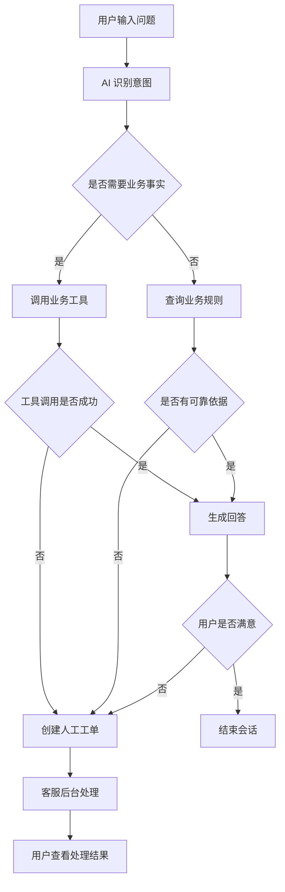
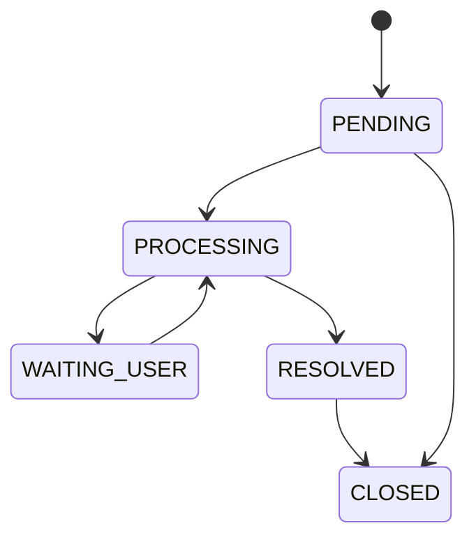

# FinServe AI 产品需求文档（PRD）

> 项目名称：FinServe AI——消费金融智能客服与工单协同平台  
> 文档版本：V1.0  
> 产品阶段：MVP  
> 目标周期：7 天完成可演示版本  
> 目标岗位：高级前端、前端偏全栈、AI 应用前端、Agent 平台前端

---

## 1. 项目背景

消费金融 App 中，用户经常咨询借款进度、还款失败、银行卡解绑、活动资格等问题。传统客服系统存在以下问题：

1. 重复问题占用大量人工客服时间；
2. 用户需要在多个页面之间查找业务状态；
3. 普通大模型容易编造用户状态或业务规则；
4. AI 无法回答时，聊天记录与人工工单之间缺少衔接；
5. 工单处理过程缺少完整的状态记录与审计轨迹。

FinServe AI 的目标不是做一个简单聊天机器人，而是构建一个“AI 先处理、工具提供事实、人工负责兜底”的消费金融客服闭环。

---

## 2. 产品定位

### 2.1 一句话定位

面向消费金融场景的智能客服与人工工单协同平台。

### 2.2 核心价值

- 对用户：快速获得可追溯、可信的业务答复；
- 对客服：减少重复咨询，自动生成结构化工单；
- 对企业：保留完整操作记录，降低 AI 错答和越权风险；
- 对项目展示：同时体现前端、Node.js 后端、数据库和轻量 Agent 能力。

### 2.3 产品原则

1. **事实由工具返回，模型不得编造。**
2. **高风险操作必须人工确认。**
3. **无可靠依据时拒答并转人工。**
4. **所有 AI 判断与工具调用可追踪。**
5. **MVP 只解决少量高频场景。**

---

## 3. 用户角色

| 角色 | 说明 | 核心诉求 |
|---|---|---|
| 普通用户 | 消费金融 App 用户 | 咨询业务问题、查看处理进度 |
| 人工客服 | 处理 AI 无法解决的问题 | 查看上下文、回复工单、更新状态 |
| 客服管理员 | 管理客服与工单 | 查看统计、分配工单、审计操作 |
| AI 服务 | 意图识别与回复生成 | 在权限范围内调用工具并给出建议 |

MVP 首期重点实现普通用户与人工客服两个角色。

---

## 4. MVP 范围

### 4.1 支持的业务场景

首版只支持以下四类咨询：

1. 借款进度查询；
2. 还款失败咨询；
3. 银行卡解绑规则查询；
4. 活动资格查询。

实际开发时可优先完成前两类，后两类作为增强项。

### 4.2 核心业务闭环



---

## 5. 功能需求

## 5.1 用户端

### 5.1.1 登录

- 用户通过账号密码登录；
- 登录成功后保存访问令牌；
- 未登录用户不可查看历史会话和工单；
- MVP 可使用预置测试账号。

### 5.1.2 智能客服会话

- 用户输入问题并发送；
- 支持流式展示 AI 回复；
- 显示当前处理状态，例如：
  - 正在识别问题；
  - 正在查询借款状态；
  - 正在查询业务规则；
  - 正在生成回复；
- 支持消息发送失败后重试；
- 支持查看当前会话历史；
- AI 回复应区分：
  - 业务事实；
  - 处理建议；
  - 风险提示；
  - 引用规则。

### 5.1.3 转人工

满足以下任一条件时创建工单：

- AI 无法识别意图；
- 意图置信度低于阈值；
- 工具调用失败；
- 没有可靠业务规则；
- 用户主动选择“转人工”；
- 涉及高风险或敏感操作。

创建工单时自动携带：

- 用户信息；
- 原始问题；
- 当前会话消息；
- AI 判断结果；
- 工具调用结果；
- 工单分类与优先级。

### 5.1.4 工单中心

用户可以：

- 查看工单列表；
- 查看工单编号、分类、状态、创建时间；
- 查看工单详情；
- 查看客服回复；
- 追加补充说明；
- 查看状态变化记录。

---

## 5.2 客服后台

### 5.2.1 工单列表

支持：

- 分页；
- 按状态筛选；
- 按分类筛选；
- 按优先级筛选；
- 按工单编号搜索；
- 按创建时间排序。

### 5.2.2 工单详情

展示：

- 用户基础信息；
- 原始会话；
- AI 意图判断；
- AI 置信度；
- 工具调用记录；
- 工单状态；
- 操作记录；
- 客服回复区。

### 5.2.3 工单流转

MVP 状态如下：

```text
PENDING        待处理
PROCESSING     处理中
WAITING_USER   等待用户补充
RESOLVED       已解决
CLOSED         已关闭
```

状态流转规则：



每次状态变更必须写入工单事件记录。

### 5.2.4 客服回复

- 客服可以提交处理回复；
- 回复后自动写入工单消息；
- 可选择是否同步更新工单状态；
- 关键操作需要二次确认。

---

## 5.3 AI 能力

### 5.3.1 意图识别

AI 输出固定结构：

```ts
interface IntentResult {
  intent:
    | 'loan_status'
    | 'repayment_failed'
    | 'unbind_card'
    | 'promotion_eligibility'
    | 'unknown'
  confidence: number
  needHuman: boolean
  reason: string
}
```

### 5.3.2 工具调用

MVP 提供以下工具：

| 工具 | 功能 | 风险等级 |
|---|---|---:|
| `queryLoanStatus` | 查询借款进度 | 低 |
| `queryRepaymentRecord` | 查询还款记录 | 中 |
| `searchBusinessRule` | 查询业务规则 | 低 |
| `createSupportTicket` | 创建人工工单 | 中 |

工具返回必须经过服务端参数校验，模型不得直接执行数据库操作。

### 5.3.3 AI 回复约束

AI 回复应遵守：

1. 不直接暴露数据库字段；
2. 不编造账户状态、金额、日期；
3. 工具失败时明确说明无法确认；
4. 无业务规则依据时拒绝给出确定结论；
5. 涉及解绑、资金、账户安全时提示人工处理；
6. 回复中不展示系统 Prompt 或内部配置。

---

## 6. 非功能需求

### 6.1 性能

- 普通接口 P95 响应时间小于 500ms；
- AI 首个流式响应目标小于 3 秒；
- 列表接口默认每页 20 条；
- 工单详情避免一次性加载过多历史消息。

### 6.2 安全

- 密码加密存储；
- JWT 鉴权；
- 用户只能查看自己的会话与工单；
- 客服接口进行角色校验；
- Tool Calling 参数必须使用 Schema 校验；
- 敏感字段返回前脱敏；
- 禁止在日志中记录密码、令牌和完整银行卡号。

### 6.3 稳定性

- 所有请求生成 Request ID；
- AI 请求超时后可降级转人工；
- 工具调用失败应记录错误原因；
- 创建工单使用幂等键，避免重复提交；
- 关键数据库写操作使用事务。

### 6.4 可观测性

记录以下指标：

- AI 请求成功率；
- AI 平均响应时间；
- 工具调用成功率；
- 转人工率；
- 工单平均处理时长；
- 接口错误率；
- 各意图命中次数。

MVP 可以先通过结构化日志和后台统计卡片展示。

---

## 7. 数据指标

### 7.1 核心指标

| 指标 | 定义 |
|---|---|
| AI 自助解决率 | 未转人工且用户结束会话的比例 |
| 转人工率 | 创建人工工单的会话占比 |
| 工具调用成功率 | 成功调用次数 / 总调用次数 |
| 工单解决时长 | 工单创建到解决的平均耗时 |
| AI 拒答准确率 | 无依据时正确拒答的比例 |

### 7.2 演示数据目标

MVP 演示时至少准备：

- 4 个测试用户；
- 20 条历史会话；
- 30 条工单；
- 10 条业务规则；
- 4 类标准问题；
- 3 类异常场景。

---

## 8. 页面清单

### 8.1 用户端

| 页面 | 路由示例 |
|---|---|
| 登录页 | `/login` |
| 智能客服 | `/chat` |
| 会话历史 | `/conversations` |
| 工单列表 | `/tickets` |
| 工单详情 | `/tickets/:id` |

### 8.2 客服端

| 页面 | 路由示例 |
|---|---|
| 客服登录 | `/admin/login` |
| 工作台 | `/admin/dashboard` |
| 工单列表 | `/admin/tickets` |
| 工单详情 | `/admin/tickets/:id` |

---

## 9. MVP 验收标准

### 9.1 用户端验收

- 用户可以完成登录；
- 用户可以发起客服会话；
- AI 可以识别至少两类意图；
- AI 可以成功调用至少两个工具；
- AI 无法处理时可以创建工单；
- 用户可以查看工单状态与客服回复。

### 9.2 客服端验收

- 客服可以查看工单列表；
- 可以筛选和分页；
- 可以查看原始对话与 AI 分析；
- 可以回复并更新工单状态；
- 状态变更可以形成事件记录。

### 9.3 工程验收

- 项目可以通过 Docker Compose 启动；
- 数据库迁移可以独立执行；
- 核心接口具有 Swagger 文档；
- 关键写操作使用事务；
- 具有统一异常处理和结构化日志；
- README 包含启动方式、测试账号和架构说明。

---

## 10. 一周开发计划

| 日期 | 目标 |
|---|---|
| 第 1 天 | 项目初始化、数据库模型、登录与鉴权 |
| 第 2 天 | 会话、消息、工单 CRUD 接口 |
| 第 3 天 | 用户端聊天与工单页面 |
| 第 4 天 | 客服后台、工单状态流转 |
| 第 5 天 | AI 意图识别、Tool Calling、转人工 |
| 第 6 天 | Docker、日志、异常处理、演示数据 |
| 第 7 天 | 测试、README、架构图、简历与演示视频 |

---

## 11. 非 MVP 范围

首版暂不实现：

- 真正的支付、扣款或账户操作；
- 多租户；
- 多 Agent；
- LangGraph 工作流；
- 向量数据库和完整 RAG；
- Kafka、Kubernetes；
- 语音客服；
- 在线客服抢单；
- 复杂客服绩效系统；
- 生产级反欺诈和合规决策。

---

## 12. 后续演进方向

### V1.1

- 接入 Redis 缓存与限流；
- 增加银行卡与活动场景；
- 完善客服分配；
- 增加 AI 质量评估数据集。

### V1.2

- PostgreSQL + pgvector 实现业务规则检索；
- 增加引用来源；
- 增加知识版本与有效期；
- 增加会话摘要。

### V2.0

- 引入 LangGraph；
- 增加人工审批节点；
- 增加可回放 Agent 执行轨迹；
- 增加工具权限分级；
- 增加质量与成本看板。

---

## 13. 简历表达建议

> 独立设计并实现消费金融智能客服与工单协同平台，基于 Next.js、NestJS、PostgreSQL 和 Prisma 完成用户会话、工单状态流转、权限控制与操作审计；接入大模型结构化输出与 Tool Calling，实现借款进度、还款记录等业务查询，并在低置信度、工具异常或无可靠依据时自动转人工，形成 AI 处理、业务工具与人工客服协同的完整闭环。
