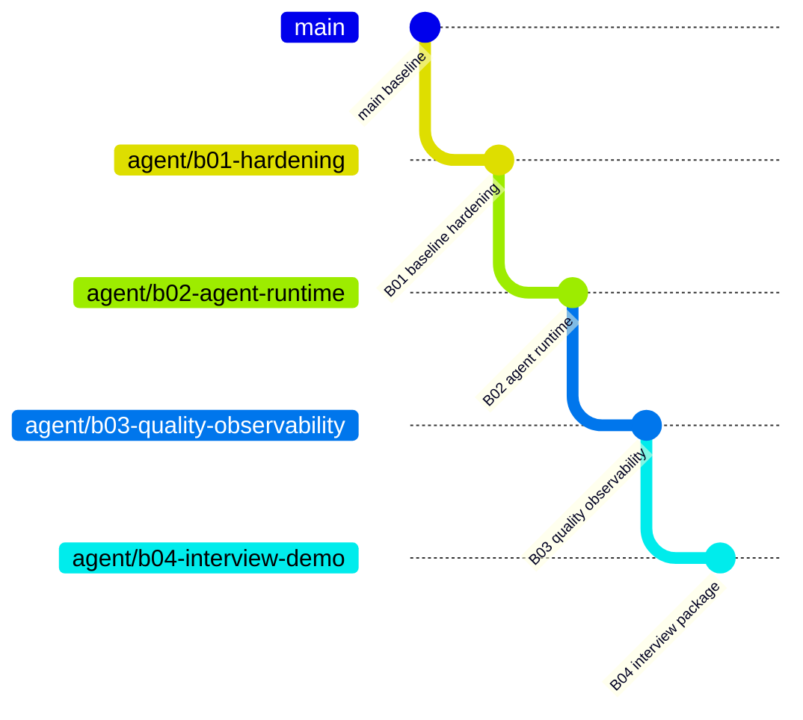

# FinServe AI 面试 ROI 迭代路线图

> 目标：用最短路径把当前 MVP 提升为可运行、可验证、可追问的 AI 全栈项目。
>
> 约束：优先完成受控 Tool Calling、人工兜底、测试、可观测性和演示证据；在 B04 完成前不引入 LangGraph、多 Agent、完整 RAG、Redis、Kafka 或微服务。

## 1. 批次与分支关系

后一批从前一批已经验证的提交创建，形成堆叠分支。每批只包含当前批次增量，避免覆盖或重复修改。

## 2. 批次总览

| 批次 | 核心结果 | 面试证明点 | 计划文档 |
|---|---|---|---|
| B01 | 安全、权限、迁移、CI 基线可信 | 服务端工程、安全边界、数据一致性 | [B01](../batches/B01_BASELINE_HARDENING.md) |
| B02 | 原生 Tool Calling 与真实流式响应 | Agent Loop、Tool Runtime、降级与取消 | [B02](../batches/B02_AGENT_RUNTIME.md) |
| B03 | 集成/E2E、指标看板、全链路追踪 | 测试体系、稳定性治理、可观测性 | [B03](../batches/B03_QUALITY_OBSERVABILITY.md) |
| B04 | AI 评估、README、演示与面试材料 | 可量化证据、技术决策、项目表达 | [B04](../batches/B04_INTERVIEW_PACKAGE.md) |

## 3. 统一交付规则

每个批次必须完成以下流程：

1. 从上一批次提交创建新分支。
2. 更新对应批次文档中的完成状态。
3. 仅实现本批次范围内的代码与文档。
4. 执行当前可用的 lint、unit、integration、E2E、build 或评估命令。
5. 记录未能在当前环境执行的验证项及原因，禁止伪造结果。
6. 提交一个聚焦的 Git commit 并推送独立远程分支。
7. 后一批基于该提交继续，不反向覆盖前一批分支。

## 4. 最终验收标准

- 浏览器不保存或提交模型密钥、模型 Base URL。
- 用户不能通过伪造资源 ID 读取他人会话或工单。
- 数据库使用可版本化 migration，演示 seed 可重复运行。
- LLM 模式使用标准 `tool_calls`；无模型密钥时仍有确定性演示降级。
- 模型输出通过 SSE 增量返回，支持取消、超时和错误事件。
- 核心后端单测、真实数据库集成测试和浏览器 E2E 有明确入口。
- GitHub Actions 自动执行质量门禁。
- 可以从 Request ID 追踪到 AI Run、Tool Call 和转人工工单。
- README、演示脚本、AI 评估结果和面试问答彼此一致，不夸大未实现能力。

## 5. 最终停止线

B04 完成后先用于简历和面试。只有真实 JD 或面试反馈持续要求知识库编排时，再评估 RAG/LangGraph；不以继续堆技术栈代替投递和面试验证。
